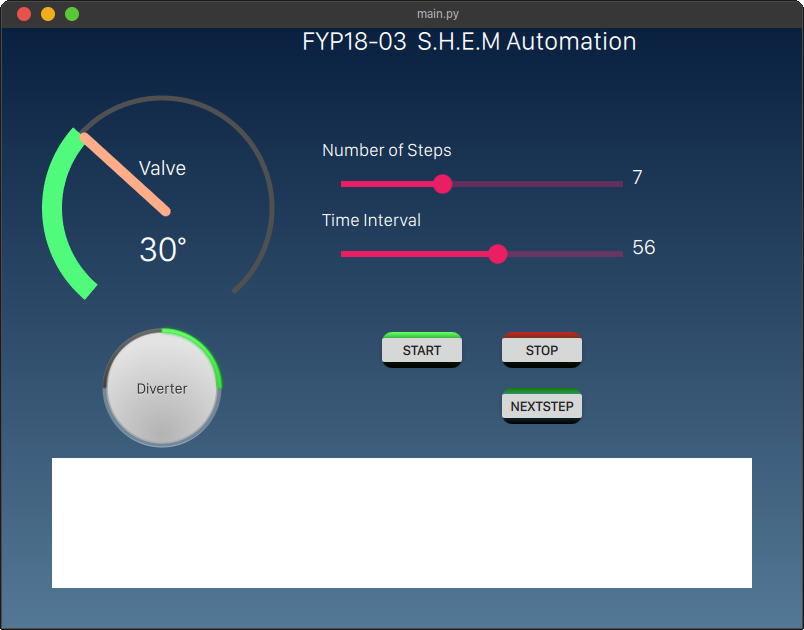

# FYP18-03 Desktop

This application to as a backup control interface for the FYP18-03 application. It makes use of an established direct ethernet connection between a PC with 
this application and the W5500 ethernet module among the FYP18-03 electronics.

## Background

Built using Qt Qml with a ```PySide 5.15``` backend



## Usage

The application can be used in three simple steps:

* Set up a static ip address on your PC's ethernet interface/adapter.
* Connect an ethernet cable between the W5500 ethernet module on the FYP18-03 application, and your PC.
* Enter the same static IP address you set on your PC in the equivalent fields provided on the GUI of the application and click connect.

The connection establishes on an instant, and you are ready to go.

### Enjoy !


